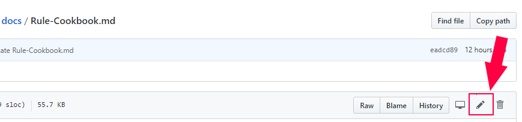
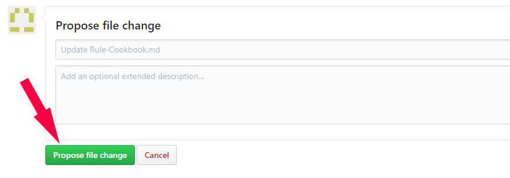
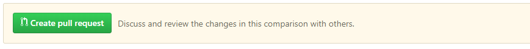
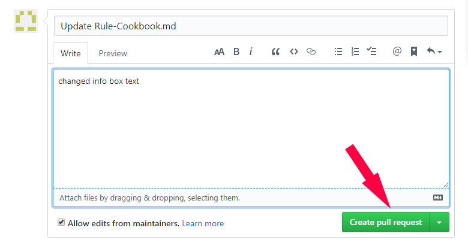

### Editing Articles
!!! failure "You need a GitHub user account to be able to edit"

If you spot an error in an article use the *pencil icon* link at the top of the page, near the title, to correct it. This version of documentation uses strick markdown syntax with some enchancements. See [Markdown Cheatsheet](https://3os.org/markdownCheatSheet/welcome/) for all features

You'll be taken to the GitHub repository page of that file.

Click on the **edit** button (pencil icon). Edit/Add the text you wanted. When finished find the **Propose file change** button at the bottom and click it.

Next you need to click **Create pull request** which is GitHub speak for propose changes.

In the PR window add a small description of what you did and click **Create pull request**

Now you wait for one of the Tasmota admins to approve your PR (or deny :smiling_imp:, no guarantees!) 

_**Congratulations**_! 

You've made a contribution to the project making it a better experience for all future users. Thank you!
