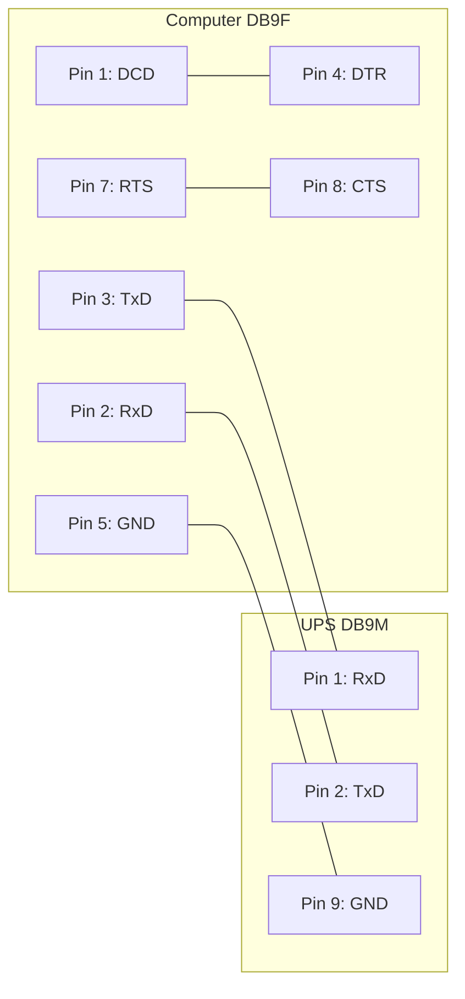

# 940-0024C Cable Wiring

**Supported Models:** SmartUPS (all models with DB9 serial port)

## Wiring Diagram

| Signal | Computer (DB9F) | UPS (DB9M) | Function                       |
| :----- | :-------------- | :--------- | :----------------------------- |
| RxD    | 2               | 2          | TxD (Send)                     |
| TxD    | 3               | 1          | RxD (Receive)                  |
| DCD    | 1               |            | Internally tied to DTR (Pin 4) |
| DTR    | 4               |            | Internally tied to DCD (Pin 1) |
| GND    | 5               | 9          | Ground                         |
| RTS    | 7               |            | Internally tied to CTS (Pin 8) |
| CTS    | 8               |            | Internally tied to RTS (Pin 7) |

**Note:** On the Computer (DB9F) side, pins 1 & 4 (DCD & DTR) and pins 7 & 8 (RTS & CTS) are internally connected.

