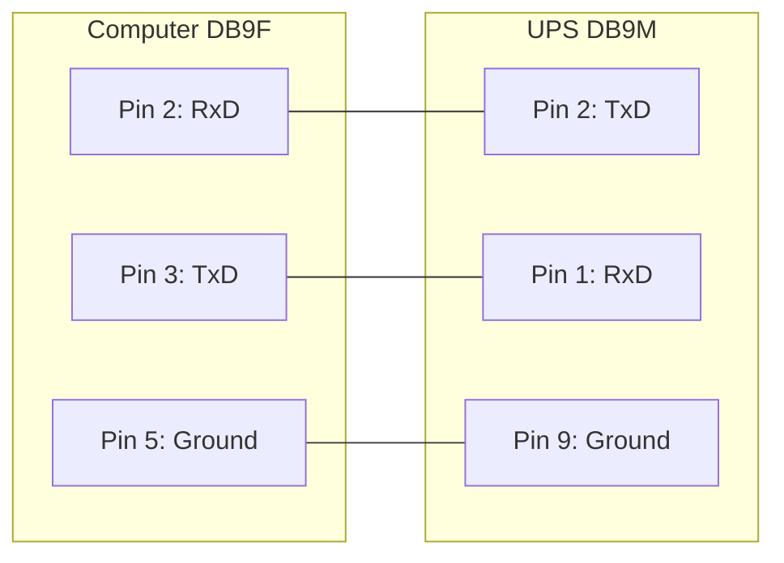

# Smart-Custom Cable for SmartUPSes

You do not have this cable unless you built it yourself. The Smart-Custom cable is not an APC product.

## SMART-CUSTOM CABLE

| Signal | Computer (DB9F) | UPS (DB9M) | Function      |
| :----- | :-------------- | :--------- | :------------ |
| RxD    | 2               | 2          | TxD (Send)    |
| TxD    | 3               | 1          | RxD (Receive) |
| GND    | 5               | 9          | Ground        |

If you have an OS that requires DCD or RTS to be set before you can receive input, you might try building the standard APC Smart 940-0024C cable (see "[940-0024C Cable Wiring](940-0024C.md)").
