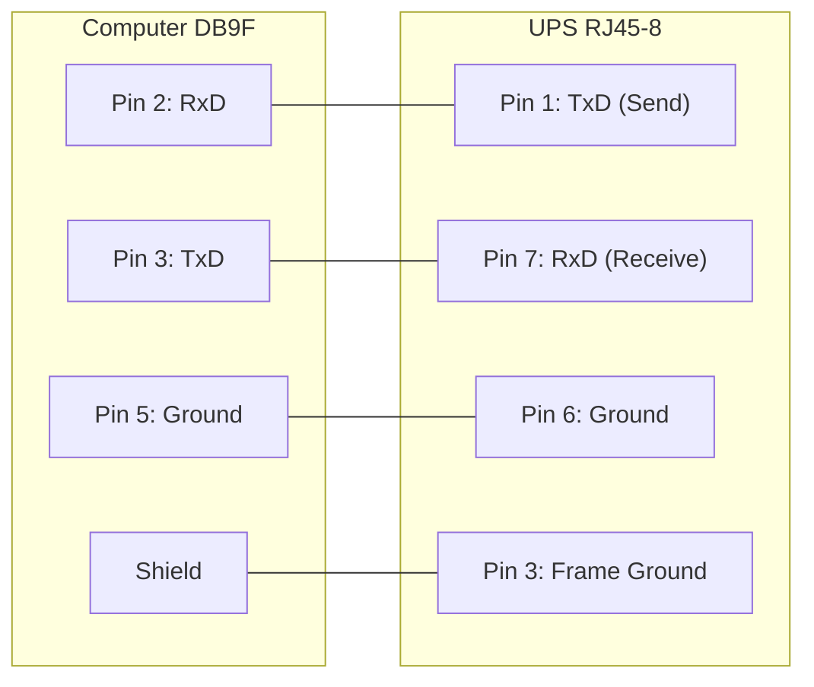
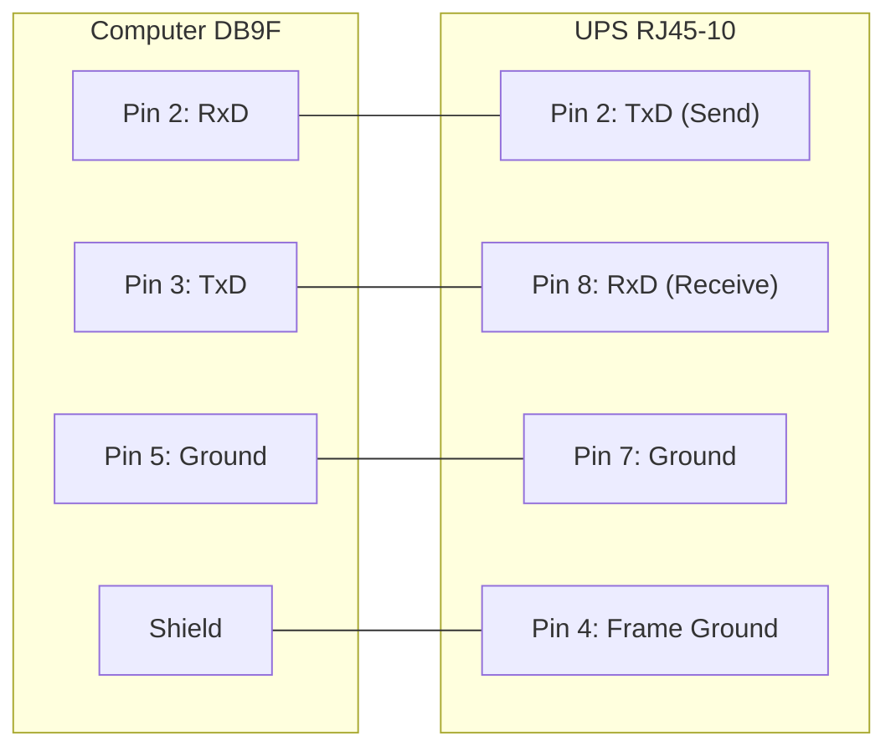

# Custom‑RJ45 Smart Signalling Cable for BackUPS CS Models

If you have a BackUPS CS, you are probably either using it with the supplied USB cable or with the 940‑0128A cable supplied by APC, which permits running the UPS in dumb mode. By building your own cable, you can run the BackUPS CS models (and perhaps also the ES models) using smart signalling—and have access to the same information available when running in USB mode.

The jack in the UPS is actually a 10‑pin RJ45. However, you can just as easily use an 8‑pin RJ45 connector (the standard Ethernet/ISDN connector). It is easy to construct the cable by cutting off one end of a standard RJ45‑8 Ethernet cable and wiring the other end (three wires) into a standard DB9F female serial port connector.

## CUSTOM‑RJ45 Cable Wiring

| Signal    | Computer (DB9F) | UPS (RJ45‑8) | UPS (RJ45‑10) | Function      |
| --------- | --------------- | ------------ | ------------- | ------------- |
| RxD       | 2               | 1            | 2             | TxD (Send)    |
| TxD       | 3               | 7            | 8             | RxD (Receive) |
| GND       | 5               | 6            | 7             | Ground        |
| FG Shield | —               | 3            | 4             | Frame Ground  |

### Connector Pin Layouts

**RJ45‑8 Connector (viewing the end of the connector):**

```
8 7 6 5 4 3 2 1
___________________
| . . . . . . . . |
|                 |
-------------------
     |____|
```

**RJ45‑10 Connector (viewing the end of the connector):**

```
10 9 8 7 6 5 4 3 2 1
_______________________
| . . . . . . . . . . |
|                     |
-----------------------
     |____|
```

For the serial port DB9F connector, the pin numbers are stamped in the plastic near each pin.

## Custom‑RJ45 Cable Diagram (Using RJ45‑8)



## Custom‑RJ45 Cable Diagram (Using RJ45‑10)



## Notes

One user, Martin, has found that if the shield is not connected to the Frame Ground as shown above, the UPS (for example, a BackUPS CS 500 EI) may become unstable and rapidly switch from mains power to batteries (i.e. "chatter").
